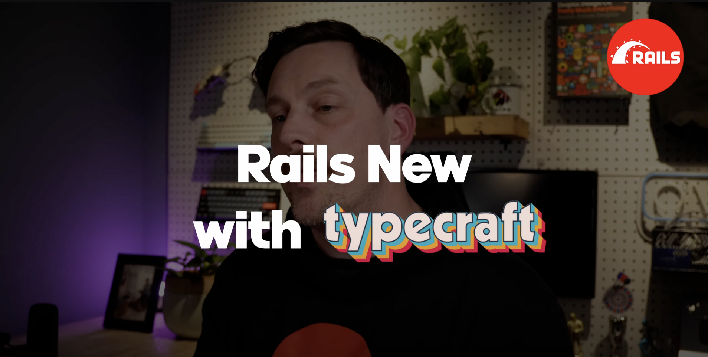

# Doable

A todo app built from "Rails New", a tutorial on the Rails YouTube channel by [Typecraft](https://typecraft.dev)

- Ruby version: 3.4.4
- Gems: tailwindcss-rails

## Get Started

Run `bin/dev` to start the rails server using Tailwind
